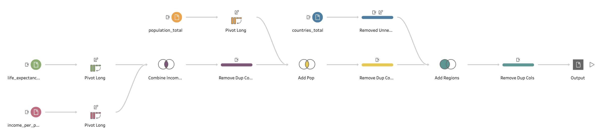
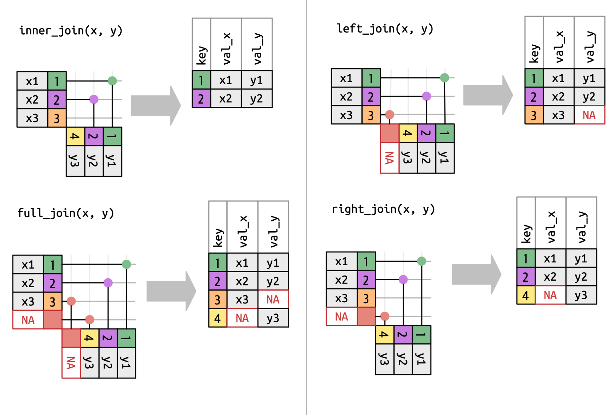

```{r setup, include = FALSE}

# set knitr options
knitr::opts_chunk$set(
  error = TRUE # continue code evaluation even if there is an error, in which case the error messages will print 
)

# set parameters to show / evaluate demo solutions
# -> so can turn on for reference while prepping and off while making
demo_code <- FALSE
demo_results <- FALSE

# disable scientific notation for readability purposes
options(scipen = 999) 

# load packages
library(learnr)
library(tidyverse)

# everything saved in here will be available to all exercise chunks
# -> so repeating any sections where saving result for later
# -> have to do this because each exercise is independent and anything saved isn't available later

# read in dataset in with desired column attributes
# -> the long string of characters for col_types argument is shorthand notation, see documentation
data_ff <- read_csv("www/french-fries.csv",
                          col_names = TRUE, col_types = "fffnnnnnn")

# french fry

# mean potato data
data_potato <- data_ff %>% 
  group_by(time) %>% 
  summarize(avg_potato = mean(potato, na.rm = TRUE))

# long data
data_long <- data_ff %>% 
  pivot_longer(cols = potato:painty,
               names_to = "flavor_type",
               values_to = "flavor_score")

# gapminder

# load data and slightly modify
data_life <- read_csv(file = "www/life_expectancy_years.csv") %>% 
  rename(country = geo)
data_income <- read_csv(file = "www/income_per_person.csv") %>% 
  rename(country = geo)
data_pop <- read_csv(file = "www/population_total.csv") %>% 
  rename(country = geo)
data_countries <- read_csv(file = "www/countries_total.csv",
                           col_select = c(country = name, country_id = `alpha-2`,region))

# long data
data_life_long <- data_life %>% 
  pivot_longer(cols = -1,
               names_to = "year",
               values_to = "life_exp")
data_income_long <- data_income %>% 
  pivot_longer(cols = -1,
               names_to = "year",
               values_to = "income")
data_pop_long <- data_pop %>% 
  pivot_longer(cols = -1,
               names_to = "year",
               values_to = "population")

# combine data
data_gapminder <- data_life_long %>% 
  inner_join(data_income_long, by = c("country", "year")) %>% 
  inner_join(data_pop_long, by = c("country", "year")) %>% 
  left_join(data_countries, by = c("country"))

# halloween data

# load candy and weather data with prespecified attributes
load(file = "www/data-halloween.RData")

```

## Overview 

### This section 

- In the previous tutorial, we learned how to create many different visuals to display one or several quantitative and/or qualitative variables.

- However, creating visuals is one of the later steps in the process of data visualization.

**tidyr** is all about cleaning up messy data and turning it into well structured / organized objects. These objects are can be easily used across all packages in the **tidyverse** (e.g. **ggplot2**, **dpylr**, etc.), which makes common data analysis tasks flow much cleaner and smoother.

### Readings

- This section covers content from [Chapter 6 - Data Tidying](https://r4ds.hadley.nz/data-tidy) of *R for Data Science (2e)*.

    - Additional topics `read_csv()` from [Chapter 8 - Data Import](https://r4ds.hadley.nz/data-import) and basic joins (which are a part of dplyr) from [Chapter 20 - Joins](https://r4ds.hadley.nz/joins).

- [tidyr help documentation](https://tidyr.tidyverse.org/index.html) contains everything you need to know about **tidyr**, including a very helpful [cheatsheet](https://github.com/rstudio/cheatsheets/blob/main/tidyr.pdf).

### Prerequisites 

- Before we can use the functions, datasets, and help pages within the **tidyverse**, which includes **readr**, **tidyr**, and **dplyr** we need to load the package. We can do this by running:

```{r tidyverse, eval = FALSE}
library(tidyverse)
```

## French fry example 

### Importing the example dataset

- The first step when working with data is to read it into R. There are functions to read in all types of data (Excel .csv and .xlsx. text files .txt, SAS files .sas7bdat, etc.).

- For an Excel .csv file, we will use `readr::read_csv()`, which has some advantages over the base R function `read.csv()`.

- It is better at reading in certain data structures. For example, if a column's data has a format like `12-1-2019`, it can recognize that as a date and save you an extra step. It also has good shorthand notation for specifying how R should read in the data.

- In addition `read_csv()` actually turns the data into a tibble. Now lets read in and preview the example dataset.

```{r ff-data}

# read in dataset in with desired column attributes
# -> the long string of characters for col_types argument is shorthand notation, see documentation
data_ff <- read_csv(file = "www/french-fries.csv",
                    col_names = TRUE, col_types = "fffnnnnnn")

# preview data
data_ff

```

- This contains information from a designed experiment where subjects were asked to taste french fries that were cooked in different oils. Subjects rated the french fries according to certain flavor attributes, repeated samples were taken.
  
- An alternative to reading the data directly is to load a .RData file which can have the dataset already loaded with pre-specified attributes.

- In a typical project workflow, after data cleaning it is a good idea to save a cleaned dataset and then start the analysis by loading in the cleaned data rather than starting with the raw data every time.

```{r ff-data2}

# alternative way to load in data with pre-specified attributes
load("www/french_fries.Rdata")

```

### Goal

- The goal is to understand the data reshaping process to create the following visual.

```{r goal-preview, echo = FALSE}

# convert from wide to tall with pivot_longer
# arguments
# -> cols = the columns to be reshaped
# -> names_to = the new ID column name
# -> values_to = the new value column name
data_long <- data_ff %>% 
  pivot_longer(cols = potato:painty,
               names_to = "flavor_type",
               values_to = "flavor_score")

# make new summary to visualize each subject, treatment, flavor and score group
data_flavor <- data_long %>% 
  group_by(time, treatment, subject, flavor_type) %>% 
  summarize(avg_flavor = mean(flavor_score, na.rm = TRUE))

# create lineplot for each persons score over time, facetted by flavor and treatment type
# add linear model "smoother" to visually emphasize trend
ggplot() + 
  geom_line(aes(x = time,
                y = avg_flavor,
                group = subject),
            data = data_flavor) + 
  stat_smooth(aes(x = time,
                  y = avg_flavor,
                  group = 1),
              data = data_flavor) + 
  facet_grid(flavor_type ~ treatment,
             scale = "free_y")

```

### Agreggating and plotting

- Before we can create the goal plot, lets create some simpler plots to build up to the goal.

-Lets start with a simple line plot of the raw data. 

```{r first-plot, exercise = TRUE}
```

```{r first-plot_demo, echo = demo_code, eval = demo_results}
ggplot() + 
  geom_point(aes(x = time,
                 y = potato),
             data = data_ff)
```

- Now lets manipulate the data so that we can visually compare the raw individual potato scores to the mean over each time period. Then plot

<!-- NOTE: we are adding a trend line, and using two different datasets in our function call -->
<!-- - group argument tells ggplot which points to connect -->
<!-- - 1 says there are no groups and just connect all of the points -->
```{r potato, exercise = TRUE}
```

```{r potato-demo, echo = demo_code, eval = demo_results}
data_potato <- data_ff %>% 
  group_by(time) %>% 
  summarize(avg_potato = mean(potato, na.rm = TRUE))

data_potato

ggplot() + 
  geom_point(aes(x = time, y = potato),
             data = data_ff) + 
  geom_line(aes(x = time, y = avg_potato),
            group = 1,
            size = 2, color = "blue",
            data = data_potato)
```

- Note that line plots typically used for time series plots. But they can also be used if there are related points across the $x$-axis.

- Lets make line plot of potato flavor over time for each subject (so we want one line per subject, across time). In order to do this, we need to format the data so that each time and subject combination are grouped together. And then we can average scores over the two batches (i.e. replications).

- Then once the new data is ready, we can create the line plot of interest.

<!-- NOTE: summarize by averaging scores of both batches for each subject / time period entry -->
<!-- - because we only group by time and subject, we are ignoring treatment -->
<!-- - make line plot to visualize weekly average score for potato for each subject -->

```{r subject-plot, exercise = TRUE}
```

```{r subject-plot-demo, echo = demo_code, eval = demo_results}
data_subject <- data_ff %>% 
  group_by(time, subject) %>% 
  summarize(avg_potato = mean(potato, na.rm = TRUE))

ggplot() + 
  geom_line(aes(x = time, y = avg_potato, group = subject),
            data = data_subject)
```

- Now we can do the same thing, but refine our analysis by incorporating the different type of oil (treatment). We do this by also grouping by the treatment applied to each batch of french fries.

- Then we can make new plot with more refined data. We can also add a smoothing line ($\approx$ mean line) for comparison, which will show the average scores across all subjects as well as the corresponding confidence band.

<!-- NOTE: summarize data again, but add oil type (treatment) -->
<!-- - so now also aggregate by oil type -->
<!-- - make new line plot -->
<!-- -- add a smoothing line with stat_smooth -->
<!-- -- this is essentially some kind of sliding window average -->

```{r smooth-line, exercise = TRUE}
```

```{r smooth-line-demo, echo = demo_code, eval = demo_results}
data_treatment <- data_ff %>% 
  group_by(time, treatment, subject) %>% 
  summarize(avg_potato = mean(potato, na.rm = TRUE))

ggplot() + 
  geom_line(aes(x = time,
                y = avg_potato,
                group = subject),
            data = data_treatment) + 
  geom_smooth(aes(x = time,
                  y = potato,
                  group = 1),
              data = data_ff) + 
  facet_grid(. ~ treatment)
```

- When doing this, we want to think about the grouping variables and how can we visualize differences (if there are any).

- Aggregating to different levels reveals some information, but we also lose information because the data is based is now from a totally different perspective. So it's important to keep this in mind when drawing conclusions.

### Reshape data

- Currently, the dataset is in wide format. So the characteristics about a single observation are represented by many columns.

- However, the each of these characteristics are related in what they represent (i.e. different types of flavors). So it makes sense to instead have one column for type of flavor and another for respective flavor score (rather than one column for potato score, another for grassy score, etc.).

- Our goal is to convert to the dataset to long (tall) format, where flavor type and flavor score variables replace the five flavor columns. Then we want to find the average score for each subject within a flavor category each week.

- To do this, we will use `tidyr::pivot_longer()`. This functions reshapes (transposes) data from wide to long and takes the following main arguments:

    - `cols` &rarr; Columns to be reshaped
    
    - `names_to` &rarr; New ID column name
    
    - `values_to` &rarr; New value column name

```{r pivot-longer, exercise = TRUE}

```

```{r pivot-longer-demo, echo = demo_code, eval = demo_results}
data_long <- data_ff %>% 
  pivot_longer(cols = potato:painty,
               names_to = "flavor_type",
               values_to = "flavor_score")
head(data_long)
```

- Now that the data is organized in a way that is conducive to the analysis we want to do, we can proceed. So we will average over the replications within each of the desired groups.

- Then create the final visual!

<!-- NOTE: make new summary to visualize each subject, treatment, flavor and score group -->
<!-- - create lineplot for each persons score over time, facetted by flavor and treatment type -->
<!-- - add linear model "smoother" to visually emphasize trend -->

```{r average-long, exercise = TRUE}
```

```{r average-long-demo, echo = demo_code, eval = demo_results}
data_flavor <- data_long %>% 
  group_by(time, treatment, subject, flavor_type) %>% 
  summarize(avg_flavor = mean(flavor_score, na.rm = TRUE))
ggplot() + 
  geom_line(aes(x = time, y = avg_flavor, group = subject),
            data = data_flavor) + 
  stat_smooth(aes(x = time, y = avg_flavor, group = 1),
              data = data_flavor) + 
  facet_grid(flavor_type ~ treatment,
             scale = "free_y")
```

-Note that we could revert the tall dataset back to its original wide format using `tidyr::pivot_wider()`. This takes the following main arguments:

    - `names_from` &rarr; Column to get the output column names from

    - `values_from` &rarr; Column to get the output values from
    
<!-- NOTE: go back from tall dataset to wide with pivot_wider -->
<!-- - the arguments and columns that should be specified are intuitive when looking at how pivot_longer was used -->
<!-- - show that this wide data is the same as the original french fry data -->
    
```{r pivot-wider, exercise = TRUE}
```

```{r pivot-wider-demo, echo = demo_code, eval = demo_results}
data_wide <- data_long %>% 
  pivot_wider(names_from = flavor_type,
              values_from = flavor_score)

data_wide

head(data_wide == data_ff)
```

## Gapminder example

- To illustrate more examples of reshaping and also merging datasets, we will recreate the Hans Rosling Gapminder visualization.

### Read in datasets

- First we need to read in the multiple gapminder datasets ([gapminder.org/data](https://www.gapminder.org/data/)) about life expectancy, income, population totals, and countries.

<!-- NOTE: point out wide data like in tableau -->

```{r data-gapminder}

# load data, rename / select columns and preview
data_life <- read_csv(file = "www/life_expectancy_years.csv") %>% 
  rename(country = geo)
head(data_life)

data_income <- read_csv(file = "www/income_per_person.csv") %>% 
  rename(country = geo)
head(data_income)

data_pop <- read_csv(file = "www/population_total.csv") %>% 
  rename(country = geo)
head(data_pop)

data_countries <- read_csv(file = "www/countries_total.csv",
                           col_select = c(country = name, country_id = `alpha-2`,region))
head(data_countries)
```

### Reshape datasets

- Now the life expectancy, income and population totals need to be pivot to be long data, just like we did with the french fry data.

<!-- NOTE: conceptually same as what did in tableau both in desktop and in prep builder -->

```{r gapminder-pivot, exercise = TRUE}
```

```{r gapminder-pivot-demo, echo = demo_code, eval = demo_results}
data_life_long <- data_life %>% 
  pivot_longer(cols = -1,
               names_to = "year",
               values_to = "life_exp")
head(data_life_long)
data_income_long <- data_income %>% 
  pivot_longer(cols = -1,
               names_to = "year",
               values_to = "income")
head(data_income_long)
data_pop_long <- data_pop %>% 
  pivot_longer(cols = -1,
               names_to = "year",
               values_to = "population")
head(data_pop_long)
```

### Combine datasets

- Now that each dataset has been converted to long format, we can begin to combine each of them into a single dataset.

{width=100%}

{width=75%}

{width=75%}

-The first step is to inner join the life expectancy, income, and population databy country and year. This will keep all observations with matching (Country, Year) values. This can be done in with a series of pipes.

- Then we can take that result and left join with the countries total data to add in the country abbreviations.

```{r combine-data, exercise = TRUE}
```

```{r combine-data-demo, echo = demo_code, eval = demo_results}
data_gapminder <- data_life_long %>% 
  inner_join(data_income_long, by = c("country", "year")) %>% 
  inner_join(data_pop_long, by = c("country", "year")) %>% 
  left_join(data_countries, by = c("country"))
```

### Visualize data

Now that the data is merged, we can recreate the visual for a particular year.

<!-- NOTE: will learn how to animate the panes next section -->
<!-- - can change scale of population size to make more readable -->

```{r visualize-data, exercise = TRUE}
```

```{r visualize-data-demo, echo = demo_code, eval = demo_results}
data_gapminder %>% 
  filter(year == max(year)) %>% 
  ggplot() + 
  geom_point(aes(x = income,
                 y = life_exp,
                 size = population / 1000000,
                 color = region)) + 
  labs(title = "Hans Rosling Gapminder Visualization",
       x = "Income per person ($)",
       y = "Life expectancy (years)",
       size = "Population size (millions)",
       color = "Region") + 
  theme_bw()
options(scipen = 999)
```

## Application

### Setup

- Load the halloween candy data ([source](https://www.dataplusscience.com/HalloweenData.html)), which contains yearly data on the number of candies given to trick-or-treaters in Cincinnati, OH dating back to 2008 and the weather data from some of those dates.

```{r data-halloween}
# load candy and weather data with prespecified attributes
load(file = "www/data-halloween.RData")
head(data_candy)
head(data_weather)
```

- Note that the candy data is already in long format because the information is repeated for each time interval.

### Part a)

- If we want to recreate the following scatterplot which visualizes maximum temperatures and total candy count, we need to have the data in wide format so that there is a separate column for the $X$ and $Y$ variable.

```{r application-preview, echo = FALSE}

# pivot to wide data, then calculate total candy count, and join with weather data
data_halloween_wide <- data_candy %>% 
  pivot_wider(names_from = Time,
              values_from = Count) %>% 
  rowwise %>% 
  mutate(total = sum(across(`6:00pm`:`8:15pm`))) %>% 
  left_join(data_weather, by = "Date")

# create scatterplot of max temp and total candy count
ggplot(data = data_halloween_wide,
       aes(x = TMAX,
           y = total)) + 
  geom_point(color = "orange") + 
  geom_text(aes(label = year(Date)),
            vjust = -1) + 
  labs(title = "Halloween candy count",
       x = "Max temp on Halloween (F)",
       y = "Total candy count") + 
  theme_bw()

```

- Note that typically wide data is better for this type of plot and for reporting because it is easier to process than long data, but long data is preferred when we are doing any grouping in our plots such as multiple lines or facets.

- Using the code chunk below, do the following:

1. Convert the `data_candy` to wide format and name the resulting object `data_halloween_wide`.

2. Add the following lines of code after the pivot, which will add the candy amounts from each time interval across the rows to get a total count for the entire night:

```{r row-total-code, eval = FALSE}
data_candy_wide <- < code to pivot wide > %>% 
  rowwise %>% 
  mutate(total = sum(c_across(`6:00pm`:`8:15pm`))) 
```

*Explanation of code:*

*- To sum across rows, data needs to be grouped by rows with `dplyr::rowwise()`.*

*- Then we can `mutate(c_across())` the columns we want (`c_across()` pairs with `rowwise()` to perform row-wise aggregations).*

3. Pipe another statement to join the weather data to the updated `data_halloween_wide`. Be sure to pick the correct type of join so that we keep all of the candy data (there is not weather data for every year).

4. Create the scatterplot of interest and try to add all of the extra features to make it a polished plot. 

```{r application, exercise = TRUE}
```

```{r application-solution}
# pivot to wide data, then calculate total candy count, and join with weather data
data_halloween_wide <- data_candy %>% 
  pivot_wider(names_from = Time,
              values_from = Count) %>% 
  rowwise %>% 
  mutate(total = sum(c_across(`6:00pm`:`8:15pm`))) %>% 
  left_join(data_weather, by = "Date")

# create scatterplot of max temp and total candy count
ggplot(data = data_halloween_wide,
       aes(x = TMAX,
           y = total)) + 
  geom_point(color = "orange") + 
  geom_text(aes(label = year(Date)),
            vjust = -1) + 
  labs(title = "Halloween candy count",
       x = "Max temp on Halloween (F)",
       y = "Total candy count") + 
  theme_bw()
```

### Part b)

- Using the code chunk below, perform the necessary data steps and recreate the following plot that visualizes the candy count by time interval across years. Try to add all of the extra features to make it a polished plot. *See the HINT to get the format the colors of the lines*.

```{r application2-preview, echo = FALSE}
# convert halloween data to long so can group by time interval for lines
data_halloween_long <- data_halloween_wide %>% 
  pivot_longer(cols = `6:00pm`:total,
               names_to = "Time",
               values_to = "Count")

# create polished line plot
data_halloween_long %>% 
  ggplot() + 
  geom_line(aes(x = Date,
                y = Count,
                group = Time,
                color = Time)) + 
  scale_color_brewer() + 
  labs(title = "Halloween candy count over the years",
       x = "Year",
       y = "Candy count",
       color = "Time slot") + 
  theme_bw()
```

```{r application2, exercise = TRUE}
```

<div id="application2-hint">
**HINT:** Add `scale_color_brewer()` to your ggplot function call for the color palette used above.
</div>

```{r application2-solution}
# convert halloween data to long so can group by time interval for lines
data_halloween_long <- data_halloween_wide %>% 
  pivot_longer(cols = `6:00pm`:total,
               names_to = "Time",
               values_to = "Count")

# create polished line plot
data_halloween_long %>% 
  ggplot() + 
  geom_line(aes(x = Date,
                y = Count,
                group = Time,
                color = Time)) + 
  scale_color_brewer() + 
  labs(title = "Halloween candy count over the years",
       x = "Year",
       y = "Candy count",
       color = "30-min time interval") + 
  theme_bw()
```